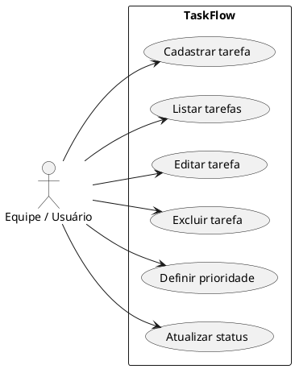

# Diagrama UML — Casos de Uso

```plantuml
@startuml
left to right direction

actor "Equipe / Usuário" as Usuario

rectangle "TaskFlow" {
  usecase "Cadastrar tarefa" as UC1
  usecase "Listar tarefas" as UC2
  usecase "Editar tarefa" as UC3
  usecase "Excluir tarefa" as UC4
  usecase "Definir prioridade" as UC5
  usecase "Atualizar status" as UC6
}

Usuario --> UC1
Usuario --> UC2
Usuario --> UC3
Usuario --> UC4
Usuario --> UC5
Usuario --> UC6
@enduml
```

**Leitura:** O usuário pode cadastrar, listar, editar e excluir tarefas, além de definir prioridades e atualizar o status.
